# Analisis Proyek: Hierarchical Task Analysis (HTA)
**Layanan Pesan-Antar Makanan (Studi Kasus: GoFood / GrabFood)**

Analisis Tugas Terstruktur (HTA) ini menggambarkan langkah-langkah pengguna dari awal membuka aplikasi hingga menyelesaikan pembayaran menggunakan dompet digital untuk memesan makanan dari restoran yang menawarkan promo.

---

## 1. Bagan Visual HTA (Mermaid Diagram)

Di bawah ini adalah representasi visual dari struktur HTA. Bagan ini membagi tugas utama (Level 0) menjadi sub-tugas (Level 1) dan merincinya lagi menjadi tindakan spesifik (Level 2).

```mermaid
graph TD
    %% Node Styling
    classDef main fill:#E1306C,stroke:#fff,stroke-width:2px,color:#fff;
    classDef sub fill:#1DA1F2,stroke:#fff,stroke-width:2px,color:#fff;
    classDef leaf fill:#34A853,stroke:#fff,stroke-width:2px,color:#fff;

    %% Level 0
    T0["0. Memesan Makanan Promo & Bayar dengan Dompet Digital"]:::main

    %% Level 1
    T1["1. Mencari Restoran Promo"]:::sub
    T2["2. Memilih Menu Makanan/Minuman"]:::sub
    T3["3. Menyelesaikan Pembayaran (Dompet Digital)"]:::sub

    T0 --- T1
    T0 --- T2
    T0 --- T3

    %% Level 2 - Task 1
    T1_1["1.1. Membuka Aplikasi"]:::leaf
    T1_2["1.2. Memverifikasi Lokasi Pengiriman"]:::leaf
    T1_3["1.3. Mengakses Kategori/Banner Promo"]:::leaf
    T1_4["1.4. Memilih Restoran Promo"]:::leaf

    T1 --- T1_1
    T1 --- T1_2
    T1 --- T1_3
    T1 --- T1_4

    %% Level 2 - Task 2
    T2_1["2.1. Membaca Menu & Mencari Label Diskon"]:::leaf
    T2_2["2.2. Mengatur Varian & Catatan Pesanan"]:::leaf
    T2_3["2.3. Memasukkan Menu ke Keranjang"]:::leaf
    T2_4["2.4. Meninjau Keranjang Belanja"]:::leaf
    T2_5["2.5. Melanjutkan ke Checkout"]:::leaf

    T2 --- T2_1
    T2 --- T2_2
    T2 --- T2_3
    T2 --- T2_4
    T2 --- T2_5

    %% Level 2 - Task 3
    T3_1["3.1. Memeriksa Alamat & Rincian Pesanan"]:::leaf
    T3_2["3.2. Memilih Metode Dompet Digital"]:::leaf
    T3_3["3.3. Memeriksa & Top-Up Saldo (Jika Perlu)"]:::leaf
    T3_4["3.4. Memasang Voucher Tambahan"]:::leaf
    T3_5["3.5. Menekan Tombol Pesan/Bayar"]:::leaf
    T3_6["3.6. Melakukan Autentikasi Keamanan"]:::leaf

    T3 --- T3_1
    T3 --- T3_2
    T3 --- T3_3
    T3 --- T3_4
    T3 --- T3_5
    T3 --- T3_6
```

---

## 2. Dekomposisi Tugas (Task Breakdown)

Berikut adalah dekomposisi hierarki tugas secara mendetail:

*   **0. Memesan makanan promo dan membayar menggunakan dompet digital**
    *   **1. Mencari restoran promo**
        *   1.1. Membuka aplikasi layanan pesan-antar makanan (GoFood/GrabFood/ShopeeFood).
        *   1.2. Menentukan atau memverifikasi alamat pengantaran agar sistem menampilkan promo yang relevan di sekitar lokasi pengguna.
        *   1.3. Mengakses fitur promo melalui banner utama, ikon kategori khusus "Promo/Diskon", atau memfilter restoran yang menawarkan promo.
        *   1.4. Menelusuri daftar restoran promo dan memilih salah satu restoran yang diinginkan.
    *   **2. Memilih menu**
        *   2.1. Membaca daftar menu restoran dan mencari menu berlabel diskon atau promo (misalnya: *Diskon Kilat*, *Buy 1 Get 1*, *Promo Bundling*).
        *   2.2. Memilih menu dan mengatur rincian pesanan (opsi rasa/varian, level pedas, topping tambahan, jumlah porsi, serta catatan khusus).
        *   2.3. Menambahkan menu yang telah dikonfigurasi ke dalam keranjang belanja.
        *   2.4. Membuka halaman keranjang untuk meninjau item yang dipilih dan memastikan tidak ada kesalahan pemesanan.
        *   2.5. Menekan tombol untuk lanjut ke halaman Checkout (Pembayaran).
    *   **3. Melakukan pembayaran menggunakan dompet digital**
        *   3.1. Memeriksa kembali alamat pengantaran, rincian biaya (harga makanan, ongkos kirim, biaya penanganan), dan estimasi waktu tiba di halaman Checkout.
        *   3.2. Memilih metode pembayaran dompet digital (misalnya: GoPay, OVO, ShopeePay, Dana, dll.) sebagai metode pembayaran aktif.
        *   3.3. Memeriksa saldo dompet digital (jika saldo kurang, beralih sementara ke alur Top-Up saldo).
        *   3.4. Memilih dan menerapkan voucher diskon tambahan (voucher ongkir gratis atau cashback) jika tersedia.
        *   3.5. Menekan tombol "Pesan" atau "Bayar".
        *   3.6. Melakukan autentikasi keamanan dompet digital (memasukkan PIN, sidik jari, atau pemindaian wajah / FaceID) untuk memproses transaksi.

---

## 3. Penomoran Plan (Rencana Eksekusi)

Setiap *plan* mendefinisikan aturan dan kondisi untuk menjalankan tugas-tugas di atas.

*   **Plan 0 (Tugas Utama):**
    Lakukan **1** (Mencari restoran promo). Setelah restoran terpilih, lakukan **2** (Memilih menu). Jika pesanan sudah lengkap di dalam keranjang, lakukan **3** (Menyelesaikan pembayaran).
*   **Plan 1 (Mencari Restoran Promo):**
    Lakukan **1.1**. Kemudian lakukan **1.2** untuk memastikan cakupan promo terdekat. Jalankan **1.3** untuk melihat daftar promo yang tersedia. Telusuri daftar promo pada **1.4**. Jika belum menemukan restoran yang cocok, kembali ke langkah **1.3** atau gulir kembali di **1.4**. Jika sudah menemukan restoran yang cocok, klik restoran tersebut untuk melanjutkan ke sub-tugas 2.
*   **Plan 2 (Memilih Menu):**
    Lakukan **2.1** untuk mencari menu promo. Lakukan **2.2** jika menu membutuhkan penyesuaian opsi rasa/porsi, kemudian jalankan **2.3** untuk menambahkannya ke keranjang. Jika ingin membeli menu lain (baik promo maupun reguler), ulangi siklus **2.1 – 2.3**. Jika telah selesai memilih, lakukan **2.4** untuk verifikasi internal keranjang, lalu lakukan **2.5** untuk menuju halaman Checkout.
*   **Plan 3 (Menyelesaikan Pembayaran):**
    Lakukan **3.1** untuk memverifikasi pesanan akhir. Jalankan **3.2** untuk mengatur metode bayar dompet digital.
    *   *Kondisi Saldo:* Jika saldo dompet digital mencukupi, lewati **3.3** dan langsung lakukan **3.4**. Jika saldo tidak cukup, jalankan **3.3** (top-up saldo atau menghubungkan rekening instan) sebelum beralih ke langkah berikutnya.
    *   Lakukan **3.4** untuk memaksimalkan potongan harga.
    *   Lakukan **3.5** untuk mengirim instruksi transaksi ke server.
    *   Lakukan **3.6** untuk konfirmasi keamanan. Jika autentikasi gagal (salah PIN/sidik jari tidak terbaca), ulangi **3.6** hingga 3 kali batas maksimal sebelum sistem membatalkan pesanan.

---

## 4. Analisis UX & Rekomendasi Desain

Sebagai bagian dari observasi aplikasi pesan-antar makanan modern, berikut adalah potensi kendala pengguna (*Pain Points*) pada setiap sub-tugas dan rekomendasi desainnya:

| Sub-Tugas | Potensi Kendala Pengguna (Pain Points) | Rekomendasi Desain UX |
| :--- | :--- | :--- |
| **1.3 (Mengakses Kategori Promo)** | Promo yang ditampilkan tidak sesuai atau sudah kedaluwarsa setelah diklik. | Gunakan filter real-time berbasis ketersediaan stok merchant dan pastikan pembaruan status promo otomatis setiap beberapa menit. |
| **2.2 (Mengatur Varian)** | Pengguna bingung dengan struktur varian wajib (e.g., tingkat kepedasan wajib diisi namun tidak terlihat jelas di UI). | Tandai opsi wajib secara kontras (misal: badge merah "Wajib") dan berikan pesan validasi yang jelas sebelum tombol "Tambah ke Keranjang" dapat diklik. |
| **3.3 (Top-Up Saldo)** | Pengguna harus keluar dari alur Checkout untuk melakukan Top-Up, meningkatkan risiko pembatalan pesanan (*Cart Abandonment*). | Sediakan fitur *Instant Top-Up* langsung di halaman checkout tanpa mengalihkan pengguna ke halaman luar, atau integrasikan fitur *One-Click Payment* yang secara otomatis memotong dari rekening bank yang terhubung jika saldo kurang. |
| **3.4 (Memasang Voucher)** | Sulit membedakan voucher mana yang memberikan potongan harga paling besar. | Implementasikan fitur **"Rekomendasi Voucher Terbaik"** atau **"Pakai Otomatis"** (*Auto-Apply*) yang langsung memilih kombinasi voucher paling menguntungkan bagi pengguna. |
| **3.6 (Autentikasi Keamanan)** | Pengguna lupa PIN dompet digital di tengah proses transaksi yang dibatasi waktu. | Integrasikan opsi biometrik yang aman (Sidik Jari/FaceID) sebagai alternatif utama PIN, serta sediakan tautan pemulihan PIN cepat via OTP WhatsApp/SMS. |
